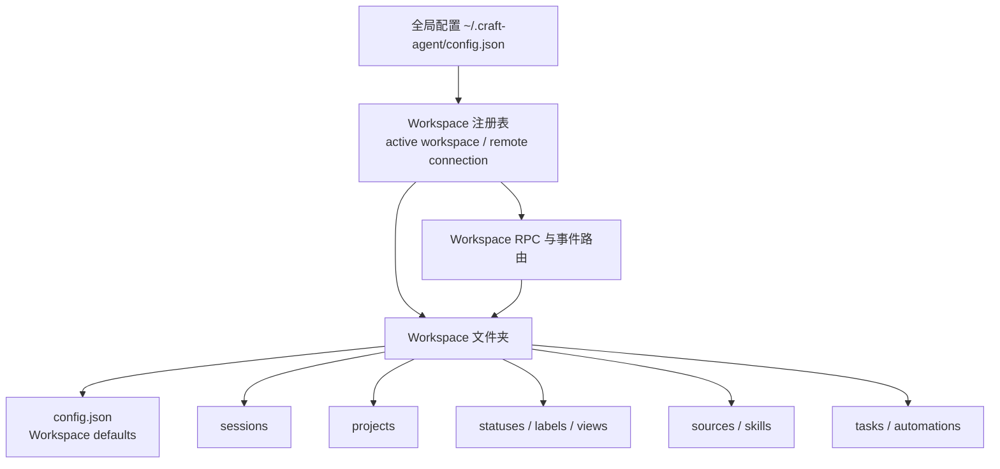
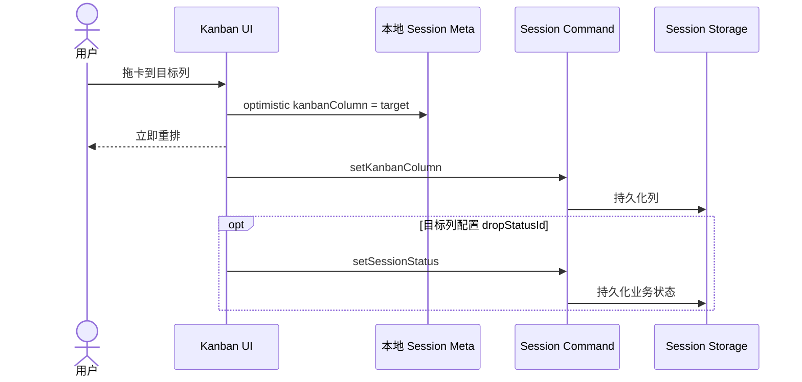
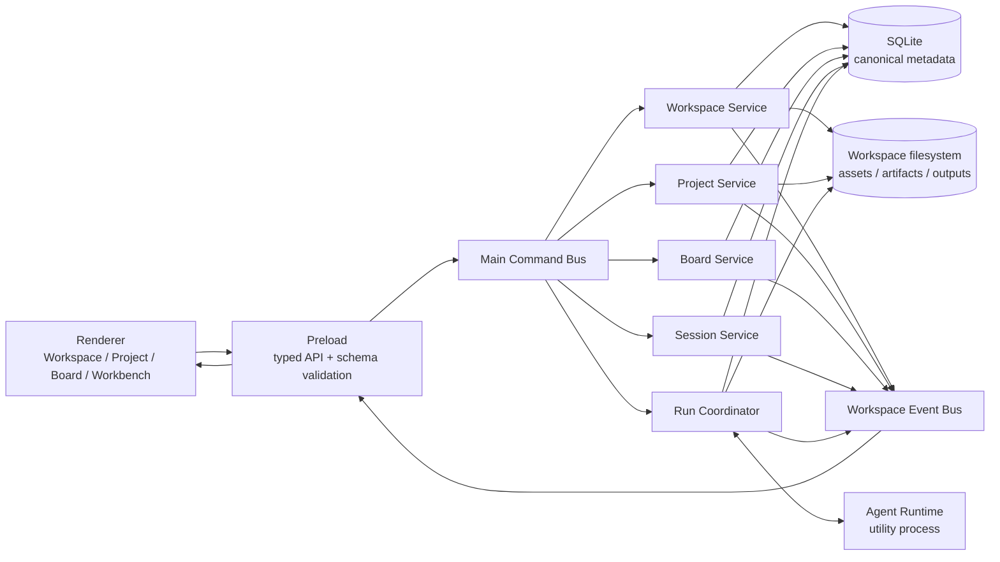
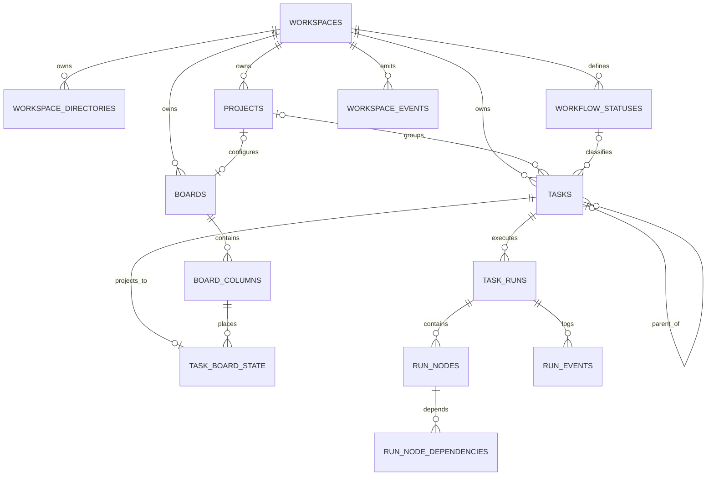
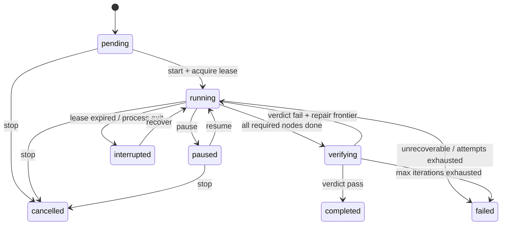

# Craft Agents Workspace / Kanban / Conductor 技术调研与 `pi-work` 落地方案

> 调研对象：[`craft-ai-agents/craft-agents-oss`](https://github.com/craft-ai-agents/craft-agents-oss)
> 固定版本：`v0.11.4`，commit [`50ffa143ab76e44c0e96ea785d03aa67cf942c50`](https://github.com/craft-ai-agents/craft-agents-oss/tree/50ffa143ab76e44c0e96ea785d03aa67cf942c50)
> 调研日期：2026-08-14
> 适用项目：`pi-work`
> 文档性质：源码级技术调研、目标架构建议与实施设计，不是 Craft 产品使用手册

## 1. 执行摘要

Craft 的 Workspace 不是“给 Agent 一个 `cwd`”这么简单，而是整个系统的顶层隔离边界。Workspace 同时拥有会话、项目、状态、资源、技能、任务、权限默认值、事件路由和本地目录；Project 是 Workspace 内进一步组织会话、工作目录和上下文的业务容器；Session 是看板上的基本卡片，也是 Agent 执行和对话的承载实体。

Craft 的 Kanban 最关键的设计，是把“业务状态”和“卡片所在列”拆成两个独立维度：

- `sessionStatus` 表达业务语义，如 `todo`、`needs-review`、`done`。
- `kanbanColumn` 表达卡片物理位置，如 `todo`、`in-progress`、`done`，也可以是项目自定义列。
- 列可以配置 `dropStatusId`，因此拖入某列时可以选择性地联动业务状态，但两者并不天然等价。

这比 `pi-work` 当前直接把 `StatusDefinition` 当作看板列更健壮。直接绑定会导致“状态分类、业务自动化、归档规则、列布局、拖动顺序”耦合在同一个对象中，后续很难支持自定义看板、跨项目总览、列删除迁移和独立状态徽标。

Craft 的复杂任务机制由 Task Spec、Orchestrator Session、TaskRunner、Node Session、运行日志和最终验收组成。它本质上是一个进程内、可有限恢复的 DAG 调度器：

1. Task YAML 描述节点、依赖、输入输出、并发和预算。
2. TaskRunner 找到依赖已满足的节点并创建子 Session。
3. 节点完成后持久化输出和状态。
4. 所有节点完成后，由父 Orchestrator 做 `PASS/FAIL` 验收。
5. 验收失败时，只重跑失败节点及其传递下游。

对 `pi-work` 的核心建议如下：

1. **保留 SQLite 作为唯一 metadata 真相源。** 不复制 Craft 的文件型配置存储；文件系统只承载 Agent 可见上下文、附件、Artifact 和大体积运行输出。
2. **把 Workspace 定义成租户、路径、权限和事件边界。** 所有 IPC command、数据库查询、Agent 事件都必须显式带 `workspaceId`，Main 进程必须验证实体归属。
3. **拆分三类状态：** `lifecycleStatus`、`workflowStatusId`、`boardColumnId + boardRank`。看板是 Session/Task 的投影，不创建另一套“卡片业务实体”。
4. **MVP 就持久化列内排序。** 使用 gap-based `INTEGER` rank，初始步长 `1024`；局部没有空隙时只重排目标列。Craft 当前没有持久化列内顺序，这一点不应照搬。
5. **把执行记录升级为可恢复的 Run。** 使用 `task_runs + run_nodes + run_events + node outputs`，支持崩溃恢复、幂等、重试、暂停和最终验收，而不是让 `runs.status` 仅镜像 Task 状态。

推荐实施顺序：

1. Workspace 契约、canonical ID、目录表、外键和事件 envelope。
2. Workflow Status 与 Board Column 解耦、稳定排序、拖卡事务。
3. Project、项目看板和项目上下文。
4. Parent/child Session 与普通子任务。
5. 可恢复 DAG Conductor。

---

## 2. 调研范围、方法与非目标

### 2.1 调研范围

本次从源码层面覆盖：

- Workspace 注册、发现、加载、配置存储和目录结构。
- 本地/远程 RPC 分类、Workspace 路由和变更事件。
- Project 与 Session、工作目录、资产、记忆的关系。
- Status 定义、Inbox/Archive 分类与 Kanban Column 投影。
- 看板过滤、拖动、自定义列、列删除迁移和乐观更新。
- Task Spec、DAG 调度、节点 Session、日志、恢复、验收和 repair。
- `pi-work` 当前 SQLite、IPC、Board、Agent Runtime、Artifact 与路径策略。

### 2.2 方法

- 将 Craft 仓库固定到 `50ffa143ab76e44c0e96ea785d03aa67cf942c50`，避免 `main` 后续变化影响结论。
- 以类型、存储层、RPC handler、Electron renderer 和 TaskRunner 的调用链交叉验证。
- 对 `pi-work` 当前实现进行本地源码审计，重点检查数据边界、状态源、排序、事件和崩溃恢复。
- 结论分为“Craft 当前事实”和“`pi-work` 推荐方案”，避免把推导误写成 Craft 已实现能力。

### 2.3 非目标

- 不复制 Craft 的视觉样式和组件结构。
- 不要求第一阶段实现远程 Workspace 或多人实时协作。
- 不要求第一阶段完整兼容 Craft Task YAML。
- 不把所有现有 `domain_entities` 一次性正规化；只优先迁移 Workspace、Status、Board、Project 和 Run 等高价值实体。
- 不在本文中直接修改 `pi-work` 业务代码。

---

## 3. Craft 的 Workspace 到底是什么

### 3.1 领域定义

Craft 源码将 Workspace 描述为顶层组织单元，所有 Source 和 Session 都被它约束。结合完整实现，Workspace 实际承担以下职责：

| 维度 | Workspace 的职责 |
|---|---|
| 身份 | Workspace ID、slug、name、注册信息 |
| 会话 | Session 的创建、加载、归档和父子关系 |
| 项目 | Project 配置、工作目录、资产和记忆 |
| 工作流 | Status、标签、看板布局 |
| Agent 能力 | Sources、Skills、MCP、权限默认值、模型默认值 |
| 自动化 | Tasks、automations、views |
| 文件边界 | Workspace 根目录及其内部资源 |
| 事件边界 | RPC route 与 Workspace-scoped broadcast |
| 远程边界 | 本地 Workspace 与远程连接的路由选择 |

因此，在 `pi-work` 中，Workspace 不应被降级成 `rootPath` 的别名。更准确的定义是：

> Workspace 是一组稳定身份、允许目录、资源配置、业务实体、运行记录和事件流共同组成的隔离域；`rootPath` 只是这个隔离域的一个文件系统入口。

### 3.2 Craft 的 Workspace 分层



全局配置回答“有哪些 Workspace、当前活动的是谁、是否通过远程连接访问”；Workspace 目录回答“这个 Workspace 里面有什么”。这种分层允许“任意绝对路径就是 Workspace”，也允许默认目录自动发现。

### 3.3 目录结构

综合源码中的存储模块，Craft Workspace 可抽象为：

```text
<workspace-root>/
├── config.json
├── sessions/
│   └── <session-id>/...
├── projects/
│   └── <project-slug>/
│       ├── config.json
│       ├── MEMORY.md
│       └── assets/
├── statuses/
│   ├── config.json
│   └── icons/
├── sources/
├── skills/
├── tasks/
│   └── <task-slug>/
│       ├── task.yaml
│       └── runs/...
├── labels/
├── automations/
├── views/
└── .claude-plugin/
    └── plugin.json
```

这个布局的优势是可观察、可手工编辑、便于同步和迁移；缺点是多实体事务、唯一约束、查询、排序、并发写入和跨文件迁移都需要应用层自行保证。

### 3.4 注册、发现与路径可移植性

Craft 同时支持：

- 默认 Workspace 目录。
- 用户提供任意绝对路径。
- 在全局配置中注册多个 Workspace。
- 记录 active Workspace。
- 在写配置时把用户主目录压缩成 `~` 或 `${HOME}`，读取时再展开。
- 对配置文件使用临时文件替换式原子写，降低进程中断造成半文件的概率。

这一思路中值得保留的是“路径展示形式”和“canonical path”分离：

- DB 中保存经过 `realpath` 的 canonical path，用于安全比较和唯一约束。
- UI 可以保存或动态生成用户友好的 display path。
- 跨设备同步时，不把本机绝对路径当作 Workspace 身份。

### 3.5 Workspace ID 的技术债

Craft 当前存在多种 Workspace 身份来源：

- 全局注册表中的 UUID。
- Workspace `config.json` 内的 `ws_xxx`。
- 从目录 basename 派生的 slug 或路由 ID。

这些值在不同层承担相近职责，增加了路径迁移、远程路由和数据关联的认知成本。

`pi-work` 应只保留一个 canonical `workspace_id`：

```ts
type WorkspaceId = string; // UUID，创建后永不改变

interface WorkspaceIdentity {
  id: WorkspaceId;
  slug: string;             // 展示/URL，可修改但需 workspace 内唯一
  rootPath: string;         // 当前设备路径，不参与实体身份
  remoteWorkspaceId?: string;
}
```

目录改名、项目移动、远程挂载都不能改变 `workspace_id`。

---

## 4. Craft 的本地/远程 RPC 与事件路由

### 4.1 两类 RPC

Craft 将调用分为两类：

- `LOCAL_ONLY`：必须在当前 Electron/Main 所在设备执行，例如本地窗口、系统能力或本地文件选择。
- `REMOTE_ELIGIBLE`：可以根据 Workspace 所属连接路由到本地 server-core 或远程服务。

这不是单纯的网络抽象，而是把“实体属于哪个 Workspace”和“该 Workspace 在哪里执行”绑定起来。

### 4.2 路由 envelope

Craft 共享协议中存在类似以下目标：

```ts
type RouteTarget =
  | { to: "local" }
  | { to: "workspace"; workspaceId: string };
```

renderer 不应决定最终访问哪个数据库或进程，它只声明目标 Workspace。路由层根据 Workspace 注册信息选择本地或远程 transport。

### 4.3 Workspace 事件

Workspace 相关变更通过 Workspace-scoped 事件分发，而不是无差别广播。事件消费者可以只刷新对应 Workspace 的 Project、Status、Source 或 Session。

Craft 还使用 ConfigWatcher 监听 labels、statuses、sources、skills 等文件变化，使手工编辑或外部同步后的配置能够回流应用。

对 `pi-work` 的启示：

- 当前 `agent:event` 向窗口广播，消息本身缺少统一 Workspace envelope。
- 后续多窗口、多 Workspace 或远程执行时，renderer 很容易收到不属于当前视图的事件。
- 必须让 Workspace 路由成为协议的一部分，而不是 UI store 的过滤约定。

推荐事件 envelope：

```ts
interface WorkspaceEvent<TType extends string, TPayload> {
  eventId: string;
  workspaceId: string;
  aggregateType: "workspace" | "project" | "session" | "board" | "run";
  aggregateId: string;
  sequence: number;
  type: TType;
  occurredAt: string;
  payload: TPayload;
}
```

---

## 5. Project、Session、Status 的关系

### 5.1 Project

Craft Project 是 Workspace 内的业务工作域，结构为：

```text
workspace/projects/<project-slug>/
├── config.json
├── MEMORY.md
└── assets/
```

Project 配置提供：

- 稳定 `id` 和可读 `slug`。
- 名称、描述和详细上下文。
- 默认 working directory。
- 颜色和主题。
- 项目资产目录。
- Agent 可读写的 `MEMORY.md`。
- 项目级自定义 `kanbanColumns`。

Session 通过稳定 `projectId` 绑定 Project，不通过目录名绑定。Project 的 working directory 是新 Session 的默认值，Session 仍可以有自己的 working directory。

Craft 加载 `MEMORY.md` 时有默认 5000 token 上限，说明项目记忆不是无界拼接进 prompt，而是受预算控制的上下文。

### 5.2 Session

Craft 的看板卡片主体是顶层 Session：

- 无 `parentSessionId`：顶层 Session，可作为看板卡片。
- 有 `parentSessionId`：子 Session，通常显示为子任务，不作为独立顶层卡片。
- 有 `taskRunId + taskNodeId`：由 Conductor 管理的节点 Session，生命周期由 TaskRunner 驱动。
- 有 `taskSlug` 的顶层 Session：复杂 Task 的 orchestrator。

因此，“Chat、Task、Card、Agent Run”不需要四套完全独立的顶层实体。Session 可以作为统一工作项，差异由 kind、父子关系和执行绑定表达。

### 5.3 Workflow Status

Craft 默认状态为：

| Status ID | 业务含义 | 分类 | 默认列 |
|---|---|---|---|
| `backlog` | 暂未进入近期计划 | open | `todo` |
| `todo` | 待处理 | open | `todo` |
| `needs-review` | 需要人工检查 | open | `in-progress` |
| `done` | 已完成 | closed | `done` |
| `cancelled` | 已取消 | closed | `done` |

状态的 `category` 是 `open | closed`：

- open 进入 Inbox/活动视图。
- closed 进入 Archive/完成视图。

状态配置还区分 fixed/default/custom，以约束能否删除和重命名。

固定 commit 的默认配置实际不包含 `in-progress` Status，但 `statusToColumn()` 仍识别该 ID，TaskRunner 启动时也会写入 `sessionStatus = "in-progress"`。这是源码内部的一处不一致：列 ID 和历史/运行状态 ID 的概念仍有残留混用。`pi-work` 不应复制这一点，运行中应由 `lifecycleStatus=running` 表达；是否联动到某个 Workspace 自定义 Workflow Status，应通过显式映射配置决定。

需要特别注意：Craft 的 `sessionStatus` 不是 Agent 运行时生命周期。一个 Session 可以：

- 业务状态为 `needs-review`；
- 物理列仍在 `in-progress`；
- 当前执行生命周期已经停止；
- 仍然属于 Inbox，因为状态 category 是 open。

---

## 6. Craft Kanban 机制

### 6.1 默认列与状态映射

Craft 默认三列：

```ts
const KANBAN_COLUMNS = [
  { id: "todo" },
  { id: "in-progress" },
  { id: "done" },
];
```

默认映射：

```ts
function statusToColumn(statusId: string): string {
  switch (statusId) {
    case "in-progress":
    case "needs-review":
      return "in-progress";
    case "done":
    case "cancelled":
      return "done";
    default:
      return "todo";
  }
}
```

映射只在 Session 没有显式 `kanbanColumn` 时作为 fallback。显式列位置优先，所以“Needs review 卡片暂时停在 To do”是允许的。

### 6.2 Project 自定义列

Project 可以保存完整、有序的 `kanbanColumns`：

```ts
interface KanbanColumnDef {
  id: string;
  name: string;
  dropStatusId?: string;
  color?: string;
}
```

行为规则：

- 单项目视图使用该项目的完整自定义列集。
- 第一次自定义时复用内置列 ID，尽量保留已有卡片位置。
- 跨项目总览使用固定默认列，避免不同项目的列集合无法合并。
- 删除列时，把该列中的卡片迁移到第一个剩余列，防止卡片消失。
- Session 引用了未知或已删除列时，回退到首列。

这说明 Project Board 是一种视图配置，Session 本身仍是 Workspace 级实体。

### 6.3 拖卡过程

Craft renderer 的核心流程：

1. 用户把卡片拖入目标列。
2. UI 先乐观写入 Session meta 的 `kanbanColumn`，卡片立即重排。
3. 异步发送 `setKanbanColumn` command 持久化。
4. 查找目标列的 `dropStatusId`。
5. 如果目标状态仍然有效，再发送 `setSessionStatus`。



### 6.4 Craft 当前缺失：列内顺序

Craft 当前没有持久化 `kanbanOrder`。列内卡片按：

```text
createdAt ?? lastMessageAt
```

由新到旧排序。因此拖卡可以改变列，但不能稳定保存“卡片在列中的第 3 个位置”。刷新、收到新消息或卡片时间变化后，顺序可能变化。

对 `pi-work` 而言，这应被视为明确缺口：

- 用户对 Kanban 的预期通常包含列内排序。
- 排序是协作、优先级和计划表达的一部分。
- 如果后补排序，会影响拖卡协议、数据库、并发控制和离线同步。

所以应在第一个正式 Board schema 中加入 `board_rank`。

### 6.5 Craft 拖卡的一致性风险

Craft 将列更新和状态更新拆成两个 RPC：

- `setKanbanColumn`
- `setSessionStatus`

这两个操作中间发生崩溃或失败时，可能只完成一个。因为 Craft 本身允许状态与列不一致，这不一定是数据错误；但如果 `dropStatusId` 被理解成必须联动，就缺少原子性。

`pi-work` 推荐使用一个领域 command，在一个 SQLite 事务内完成：

```ts
moveBoardCard({
  taskId,
  toColumnId,
  beforeTaskId,
  afterTaskId,
  applyDropStatus: true,
});
```

---

## 7. Craft Task / Conductor 机制

### 7.1 三种任务形态

| 形态 | 数据结构 | 执行方式 |
|---|---|---|
| 快速任务 | 顶层 Session | 用户直接与 Agent 对话 |
| 普通子任务 | `parentSessionId` 子 Session | 用户或父 Session 驱动 |
| 复杂任务 | Task YAML + Orchestrator + Node Sessions | TaskRunner 调度 DAG |

### 7.2 Task 创建

创建复杂 Task 时，Craft 会：

1. 把 spec 写入 `tasks/<slug>/task.yaml`。
2. 创建一个带 `taskSlug` 的顶层 orchestrator Session。
3. 不立即执行 DAG，等待显式 start。

AI 辅助生成 Task 时，会先创建隐藏 `taskDraft` Session；用户确认后把 draft 原地提升成正式 orchestrator，避免“草稿会话 + 正式任务”生成两张卡片。

### 7.3 Task Spec

Task YAML 的核心信息：

```yaml
id: research-and-implement
title: Research and implement workspace
goal: ...
acceptance_criteria:
  - ...

project: workspace-project
cwd: /repo

sources: []
skills: []

defaults:
  model: ...
  permission_mode: ask

params:
  target: pi-work

token_budget: 200000
max_parallel: 4
max_iterations: 3

nodes:
  - id: research
    prompt: ...
    outputs: [report]

  - id: implementation
    depends_on: [research]
    inputs:
      research: ${nodes.research.output}
    prompt: ...
    retry:
      max_attempts: 2

outputs:
  summary: ${nodes.implementation.output}
```

Schema 中还解析了 route、loop、approval 等扩展字段，但固定版本的 TaskRunner 并未完整执行所有高级语义。设计 `pi-work` Conductor 时，应区分“schema 可表达”和“runner 已支持”，不要一次暴露未闭环能力。

### 7.4 DAG 调度

TaskRunner 是进程内调度器，默认最大并发为 4。其主循环可概括为：

```text
读取 run snapshot
  ↓
将可恢复节点归一化
  ↓
查找 pending 且依赖全部 done 的节点
  ↓
在 max_parallel 限制内启动节点 Session
  ↓
监听完成 / 失败 / token budget / stop
  ↓
更新 node state 与 run log
  ↓
全部完成后进入 verifying
```

每个节点启动时：

- 创建带 `taskRunId`、`taskNodeId` 的子 Session。
- 将 `${nodes.*.output}`、`${params.*}`、`${inputs.*}` 插值到 prompt。
- 继承 Task 或 Node 级模型、Source、Skill、权限和 cwd。
- 由 Session 运行结果推进节点状态。

Conductor-owned 子 Session 不允许被普通批量执行逻辑再次触发，否则会发生 double-run。

### 7.5 运行持久化

Craft 每个 Run 持久化：

```text
runs/<run-id>/
├── spec.json
├── run-log.jsonl
└── nodes/
    ├── <node-id>.json
    └── ...
```

恢复规则：

- `done` 且输出存在：复用输出。
- `done` 但输出缺失：回到 pending，重新执行。
- `running`：进程重启后回到 pending。
- `cancelled`：恢复时回到 pending。
- 其他失败节点根据 retry 与 repair 决策处理。

这已经具备“事件日志 + 节点快照”的雏形，但 metadata 仍以文件为主。

### 7.6 状态映射

TaskRunner 会把运行状态反馈到 Session：

| 执行事件 | Session 状态/列 |
|---|---|
| 开始运行 | `in-progress` |
| 节点完成 | `done` |
| 节点失败 | `needs-review` |
| 中断/停止 | 列回 `todo` |
| 父任务验收通过 | `done` |

这里也能看到业务状态、看板列和运行状态是相关但不同的维度。

### 7.7 最终验收与 repair frontier

全部节点完成后，Orchestrator 必须输出：

```text
VERDICT: PASS
```

或：

```text
VERDICT: FAIL — <reason>
nodes=node-a,node-b
```

FAIL 时：

- 如果指定节点，repair frontier = 指定节点 + 所有传递下游节点。
- 如果没有指定节点，默认整个 DAG 进入 repair。
- 已完成但位于 frontier 内的节点被重置并重跑。
- 默认最多 repair 3 次，代码允许的上限为 10。

这比“失败后全任务从头再跑”更节省 token，也保留了未受影响节点的结果。

### 7.8 Pause、Resume、Stop 与预算

TaskRunner 支持：

- token budget。
- 节点有限重试。
- pause / resume。
- stop。
- 一个 orchestrator 同时只允许一个活动 run。

当前实现的一个竞态是：Run 处于 `verifying` 时，如果用户向 orchestrator 发送普通消息，该输入有可能被验收逻辑当作 verdict 处理。`pi-work` 应把“用户消息”和“机器验收结果”做协议级区分，不依靠自由文本通道复用。

---

## 8. Craft 值得借鉴的部分与不应照搬的技术债

### 8.1 值得借鉴

| 设计 | 价值 |
|---|---|
| Workspace 顶层隔离 | 资源、会话、权限、目录和事件有统一边界 |
| Folder is Workspace | 用户心智简单，支持任意已有目录 |
| Project 独立于 Workspace | 同一 Workspace 可承载多个工作域 |
| Session 统一工作项 | 对话、任务、卡片、节点无需完全割裂 |
| Status 与 Column 解耦 | 业务语义和视图布局可独立演化 |
| `dropStatusId` | 拖卡可选联动业务状态 |
| 顶层/子 Session | 普通任务拆分机制简单直观 |
| Task DAG + 验收 | 复杂任务具备依赖、并发和质量闭环 |
| Run log + node snapshot | 具备崩溃恢复基础 |
| Workspace route | 为远程执行和多窗口准备好协议边界 |

### 8.2 不应照搬

| 技术债 | 对 `pi-work` 的处理 |
|---|---|
| 多套 Workspace ID | 只保留 canonical UUID |
| metadata 大量存 JSON 文件 | SQLite 作为唯一 metadata 真相源 |
| 看板列内顺序不持久化 | 首版加入 `board_rank` |
| 列和状态分两次 RPC | 单个原子 command |
| 列删除逐卡异步迁移 | 单事务批量迁移 |
| Task 高级字段部分只解析不执行 | capability/version 明确标注 |
| verifying 复用自然语言消息 | 独立 verdict command/event |
| 进程内 runner 缺少持久租约 | Run lease + recovery scan |
| 文件存储跨实体事务弱 | DB transaction + filesystem reconciliation |

---

## 9. `pi-work` 当前实现审计

### 9.1 已有能力

`pi-work` 当前已经具备一个很好的基础：

- Electron Main 中的 SQLite 位于 `userData/pi-work.db`。
- 已有 `workspaces`、`tasks`、`messages`、`plans`、`runs`、`artifacts`、`events`、`domain_entities`、`activities`、`attachments`、`model_usage`、`telemetry_outbox`。
- Workspace 已有 `managed | folder` 两种类型。
- Session/Task 已统一在 `tasks` 表，通过 `kind = chat | task` 区分。
- 已有较完整生命周期：`draft`、`planning`、`awaiting_plan_approval`、`running`、`awaiting_action_approval`、`reviewing`、`completed`、`failed`、`cancelled`。
- 已有 `StatusDefinition`、标签、Board、Inbox/Attention/Completed。
- preload 负责隔离，协议层使用 Zod 校验。
- Agent Runtime 在 utility process 中运行。
- 已有 working directory 边界校验。
- Artifact 已采用混合存储：metadata/content 在 SQLite，staging 在 `<workspace>/.pi-work/runs/<task>/staging`，published 在 `workspace.outputPath`。
- 个人 Session 当前可以先使用独立 managed Workspace，再提升到 folder Workspace。

相关本地源码：

- `packages/storage/src/schema.ts`
- `packages/storage/src/index.ts`
- `packages/protocol/src/index.ts`
- `apps/desktop/src/main/index.ts`
- `apps/desktop/src/preload/index.ts`
- `apps/desktop/src/renderer/board.ts`
- `apps/desktop/src/renderer/store.ts`
- `apps/desktop/src/renderer/features/workspace-pages.tsx`
- `apps/desktop/src/renderer/features/task-workbench.tsx`
- `packages/artifacts/src/index.ts`
- `packages/policy/src/index.ts`

### 9.2 关键差距矩阵

| 领域 | 当前实现 | 目标 | 优先级 |
|---|---|---|---|
| Workspace 身份 | UUID + rootPath，结构较薄 | 稳定 ID、目录集合、状态、版本和事件边界 | P0 |
| 目录 | `directories` JSON 字符串 | `workspace_directories` 正规化、canonical path | P0 |
| 外键 | DDL 未显式启用/声明完整 FK | `PRAGMA foreign_keys=ON` + 明确删除策略 | P0 |
| Board | StatusDefinition 直接作为列 | Status 与 Column 解耦 | P0 |
| 拖卡 | `session.update({statusId})` | `board.moveCard` 原子 command | P0 |
| 列内排序 | 无持久排序 | gap-based rank | P0 |
| 状态删除 | Task `status_id` 可能直接置空 | 必须指定迁移目标或阻止删除 | P0 |
| 事件 sequence | `TEXT`，通过读取全量长度生成 | `INTEGER` + stream head 原子递增 | P0 |
| Agent 事件 | `agent:event` 窗口广播 | Workspace-scoped envelope | P0 |
| 双状态源 | `status` + `running` | 生命周期 + active run 派生 | P1 |
| Project | 缺少一等实体 | Project 表、上下文、资产、项目 Board | P1 |
| 父子任务 | Subtask 偏 checklist | `parent_task_id` Session 层级 | P1 |
| Run | 基本是 TaskStatus 镜像 | 可恢复执行实例 | P1 |
| Node | 无 DAG node snapshot | `run_nodes + dependencies + outputs` | P2 |
| Domain JSON | `domain_entities.value` | 高频领域实体正规化 | P1/P2 |
| 路径安全 | 部分校验未 canonicalize | 所有入口 `realpath` + symlink 防逃逸 | P0 |
| 活动持久化 | 部分运行活动内存聚合 | run events append-only | P1 |

### 9.3 当前事件 sequence 的具体问题

`events.sequence` 当前是 `TEXT`：

- 字符串排序下 `"10"` 可能排在 `"2"` 前。
- `appendEvent` 通过读取该 Task 全部事件并取数组长度生成下一个 sequence，复杂度 O(n)。
- 两个并发写入都可能算出相同 sequence。
- 没有 `(task_id, sequence)` 唯一约束来阻止冲突。

这应作为 Workspace 改造的 P0 migration 一并处理，而不是等 Conductor 再修。

### 9.4 当前 Board 的具体问题

`workspace-pages.tsx` 直接构造：

```ts
const columns: Array<StatusDefinition | null> = [...statuses, null];
```

拖动调用：

```ts
window.piWork.session.update({ sessionId, statusId });
```

这意味着：

- 改列 = 改业务状态。
- 无法让多个状态映射到一列。
- 无法让一个状态的卡片停在不同列。
- 无法支持项目自定义列而不复制状态。
- 无法保存列内顺序。
- 自动化的 `status_changed` 会被纯布局拖动意外触发。

---

## 10. `pi-work` 推荐目标架构

### 10.1 架构原则

1. **SQLite 是 metadata、关系、事务、排序和索引的唯一权威。**
2. **文件系统存大对象和 Agent 可见内容，不承担跨实体业务一致性。**
3. **所有实体都显式属于 Workspace。**
4. **Renderer 不能只凭 entity ID 发命令，必须同时提交 `workspaceId`。**
5. **Main 进程从 DB 验证实体归属，不能信任 renderer 的路径和关联。**
6. **业务状态、执行生命周期和看板位置分离。**
7. **Command 幂等，Event 可重放，Projection 可重建。**
8. **本地优先，但协议不把本地绝对路径当身份。**

### 10.2 组件图



### 10.3 Workspace 文件布局

推荐保留用户项目根目录，同时把 `pi-work` 的运行文件集中到 `.pi-work`：

```text
<workspace-root>/
├── ...用户项目文件
└── .pi-work/
    ├── workspace.json            # 可选：只保存 portable identity/version，不做真相源
    ├── projects/
    │   └── <project-id>/
    │       ├── MEMORY.md
    │       └── assets/
    ├── runs/
    │   └── <run-id>/
    │       ├── spec.json
    │       ├── events.jsonl      # 可选镜像；DB 仍是索引和状态权威
    │       ├── nodes/
    │       └── staging/
    └── cache/
```

`workspace.json` 如存在，只应包含：

```json
{
  "schemaVersion": 1,
  "workspaceId": "uuid",
  "createdBy": "pi-work"
}
```

不建议把 Status、Board、Project mutable metadata 再复制到 JSON 文件，否则会产生双向同步和冲突解决问题。

### 10.4 Workspace 生命周期

推荐状态：

```ts
type WorkspaceState =
  | "provisioning"
  | "ready"
  | "unavailable"
  | "detached"
  | "deleting";
```

创建 folder Workspace 的流程：

1. renderer 提交候选目录。
2. Main `resolve + realpath`。
3. 验证目录存在、可访问、未与其他 Workspace 形成禁止的重叠。
4. 开启 DB 事务，插入 `provisioning` Workspace 和目录记录。
5. 创建 `.pi-work` 所需目录。
6. 成功后更新为 `ready`；失败则记录错误并由 reconciler 清理或重试。

DB 与文件系统无法形成真正原子事务，因此不要假装“一次函数调用天然原子”。使用 provisioning 状态和启动时 reconciler 解决中间失败。

---

## 11. 推荐领域模型

```ts
type UUID = string;
type ISODateTime = string;

interface Workspace {
  id: UUID;
  slug: string;
  name: string;
  kind: "managed" | "folder";
  state: "provisioning" | "ready" | "unavailable" | "detached" | "deleting";
  rootPath: string;
  canonicalRootPath: string;
  outputPath: string;
  version: number;
  createdAt: ISODateTime;
  updatedAt: ISODateTime;
}

interface WorkspaceDirectory {
  id: UUID;
  workspaceId: UUID;
  role: "root" | "source" | "output";
  path: string;
  canonicalPath: string;
  position: number;
}

interface Project {
  id: UUID;
  workspaceId: UUID;
  slug: string;
  name: string;
  description?: string;
  details?: string;
  workingDirectory?: string;
  memoryRelativePath?: string;
  color?: string;
  version: number;
  archivedAt?: ISODateTime;
}

type LifecycleStatus =
  | "draft"
  | "planning"
  | "awaiting_plan_approval"
  | "queued"
  | "running"
  | "paused"
  | "awaiting_action_approval"
  | "reviewing"
  | "completed"
  | "failed"
  | "cancelled";

interface Session {
  id: UUID;
  workspaceId: UUID;
  projectId?: UUID;
  parentSessionId?: UUID;
  kind: "chat" | "task" | "orchestrator" | "node";
  title: string;
  goal: string;
  lifecycleStatus: LifecycleStatus;
  workflowStatusId?: UUID;
  workingDirectory?: string;
  version: number;
  createdAt: ISODateTime;
  updatedAt: ISODateTime;
}

interface WorkflowStatus {
  id: UUID;
  workspaceId: UUID;
  name: string;
  category: "open" | "closed";
  color?: string;
  icon?: string;
  isFixed: boolean;
  sortOrder: number;
  version: number;
}

interface Board {
  id: UUID;
  workspaceId: UUID;
  projectId?: UUID;
  kind: "workspace" | "project";
  version: number;
}

interface BoardColumn {
  id: UUID;
  workspaceId: UUID;
  boardId: UUID;
  name: string;
  position: number;
  dropStatusId?: UUID;
  color?: string;
  version: number;
}

interface TaskBoardState {
  workspaceId: UUID;
  taskId: UUID;
  boardId: UUID;
  columnId: UUID;
  rank: number;
  version: number;
}

interface TaskRun {
  id: UUID;
  workspaceId: UUID;
  taskId: UUID;
  status:
    | "pending"
    | "running"
    | "paused"
    | "verifying"
    | "completed"
    | "failed"
    | "cancelled"
    | "interrupted";
  tokenBudget?: number;
  tokensUsed: number;
  maxParallel: number;
  iteration: number;
  maxIterations: number;
  leaseOwner?: string;
  leaseExpiresAt?: ISODateTime;
  version: number;
}
```

### 11.1 三类状态的职责

| 字段 | 回答的问题 | 示例 |
|---|---|---|
| `lifecycleStatus` | 系统当前执行到哪一步 | `running`、`awaiting_action_approval` |
| `workflowStatusId` | 用户如何理解这项工作 | `todo`、`needs-review`、`done` |
| `columnId + rank` | 卡片在当前 Board 哪里 | `in-progress` 列，第 2048 位 |

`running: boolean` 应逐步移除。是否正在运行可以从 active `task_run` 推导；若 UI 高频需要，可建立受控 projection，但不能让 boolean 和 lifecycle status 都可被任意更新。

---

## 12. 推荐 SQLite 数据模型

### 12.1 ER 图



### 12.2 DDL

以下是目标核心表的参考 DDL。实际迁移现有 `tasks` 时，应使用 shadow table：创建 `tasks_v2`、复制转换、校验行数和外键、重命名，而不是依赖 SQLite 对复杂 `ALTER TABLE` 的有限支持。

```sql
PRAGMA foreign_keys = ON;
PRAGMA journal_mode = WAL;
PRAGMA synchronous = NORMAL;
PRAGMA busy_timeout = 5000;

CREATE TABLE workspaces (
  id                  TEXT PRIMARY KEY,
  slug                TEXT NOT NULL,
  name                TEXT NOT NULL,
  kind                TEXT NOT NULL CHECK (kind IN ('managed', 'folder')),
  state               TEXT NOT NULL CHECK (
                        state IN ('provisioning', 'ready', 'unavailable', 'detached', 'deleting')
                      ),
  root_path           TEXT NOT NULL,
  canonical_root_path TEXT NOT NULL,
  output_path         TEXT NOT NULL,
  version             INTEGER NOT NULL DEFAULT 0,
  created_at          TEXT NOT NULL,
  updated_at          TEXT NOT NULL,
  UNIQUE (slug),
  UNIQUE (canonical_root_path)
);

CREATE TABLE workspace_directories (
  id             TEXT PRIMARY KEY,
  workspace_id   TEXT NOT NULL,
  role           TEXT NOT NULL CHECK (role IN ('root', 'source', 'output')),
  path           TEXT NOT NULL,
  canonical_path TEXT NOT NULL,
  position       INTEGER NOT NULL DEFAULT 0,
  created_at     TEXT NOT NULL,
  FOREIGN KEY (workspace_id) REFERENCES workspaces(id) ON DELETE CASCADE,
  UNIQUE (workspace_id, canonical_path)
);

CREATE INDEX workspace_directories_workspace_position
  ON workspace_directories(workspace_id, position);

CREATE TABLE projects (
  id                   TEXT PRIMARY KEY,
  workspace_id         TEXT NOT NULL,
  slug                 TEXT NOT NULL,
  name                 TEXT NOT NULL,
  description          TEXT,
  details              TEXT,
  working_directory    TEXT,
  memory_relative_path TEXT,
  color                TEXT,
  version              INTEGER NOT NULL DEFAULT 0,
  archived_at          TEXT,
  created_at           TEXT NOT NULL,
  updated_at           TEXT NOT NULL,
  FOREIGN KEY (workspace_id) REFERENCES workspaces(id) ON DELETE CASCADE,
  UNIQUE (workspace_id, id),
  UNIQUE (workspace_id, slug)
);

CREATE TABLE workflow_statuses (
  id           TEXT PRIMARY KEY,
  workspace_id TEXT NOT NULL,
  name         TEXT NOT NULL,
  category     TEXT NOT NULL CHECK (category IN ('open', 'closed')),
  color        TEXT,
  icon         TEXT,
  is_fixed     INTEGER NOT NULL DEFAULT 0 CHECK (is_fixed IN (0, 1)),
  sort_order   INTEGER NOT NULL,
  version      INTEGER NOT NULL DEFAULT 0,
  created_at   TEXT NOT NULL,
  updated_at   TEXT NOT NULL,
  FOREIGN KEY (workspace_id) REFERENCES workspaces(id) ON DELETE CASCADE,
  UNIQUE (workspace_id, id),
  UNIQUE (workspace_id, sort_order)
);

CREATE TABLE tasks (
  id                  TEXT PRIMARY KEY,
  workspace_id        TEXT NOT NULL,
  project_id          TEXT,
  parent_task_id      TEXT,
  kind                TEXT NOT NULL CHECK (
                        kind IN ('chat', 'task', 'orchestrator', 'node')
                      ),
  title               TEXT NOT NULL,
  goal                TEXT NOT NULL,
  lifecycle_status    TEXT NOT NULL CHECK (
                        lifecycle_status IN (
                          'draft',
                          'planning',
                          'awaiting_plan_approval',
                          'queued',
                          'running',
                          'paused',
                          'awaiting_action_approval',
                          'reviewing',
                          'completed',
                          'failed',
                          'cancelled'
                        )
                      ),
  workflow_status_id  TEXT,
  provider_id         TEXT,
  model_id            TEXT,
  thinking_level      TEXT NOT NULL,
  permission_mode     TEXT NOT NULL,
  plan_mode           INTEGER NOT NULL DEFAULT 0 CHECK (plan_mode IN (0, 1)),
  working_directory   TEXT,
  archived            INTEGER NOT NULL DEFAULT 0 CHECK (archived IN (0, 1)),
  flagged             INTEGER NOT NULL DEFAULT 0 CHECK (flagged IN (0, 1)),
  unread              INTEGER NOT NULL DEFAULT 0 CHECK (unread IN (0, 1)),
  version             INTEGER NOT NULL DEFAULT 0,
  created_at          TEXT NOT NULL,
  updated_at          TEXT NOT NULL,
  FOREIGN KEY (workspace_id) REFERENCES workspaces(id) ON DELETE CASCADE,
  FOREIGN KEY (workspace_id, project_id)
    REFERENCES projects(workspace_id, id) ON DELETE RESTRICT,
  FOREIGN KEY (workspace_id, parent_task_id)
    REFERENCES tasks(workspace_id, id) ON DELETE CASCADE,
  FOREIGN KEY (workspace_id, workflow_status_id)
    REFERENCES workflow_statuses(workspace_id, id) ON DELETE RESTRICT,
  UNIQUE (workspace_id, id)
);

CREATE INDEX tasks_workspace_updated
  ON tasks(workspace_id, updated_at DESC);

CREATE INDEX tasks_workspace_project
  ON tasks(workspace_id, project_id, archived);

CREATE INDEX tasks_workspace_parent
  ON tasks(workspace_id, parent_task_id);

CREATE INDEX tasks_workspace_status
  ON tasks(workspace_id, workflow_status_id, archived);

CREATE TABLE boards (
  id           TEXT PRIMARY KEY,
  workspace_id TEXT NOT NULL,
  project_id   TEXT,
  kind         TEXT NOT NULL CHECK (kind IN ('workspace', 'project')),
  name         TEXT NOT NULL,
  version      INTEGER NOT NULL DEFAULT 0,
  created_at   TEXT NOT NULL,
  updated_at   TEXT NOT NULL,
  FOREIGN KEY (workspace_id) REFERENCES workspaces(id) ON DELETE CASCADE,
  FOREIGN KEY (workspace_id, project_id)
    REFERENCES projects(workspace_id, id) ON DELETE CASCADE,
  UNIQUE (workspace_id, id),
  UNIQUE (workspace_id, project_id)
);

CREATE UNIQUE INDEX one_workspace_default_board
  ON boards(workspace_id)
  WHERE project_id IS NULL;

CREATE TABLE board_columns (
  id             TEXT PRIMARY KEY,
  workspace_id   TEXT NOT NULL,
  board_id       TEXT NOT NULL,
  name           TEXT NOT NULL,
  position       INTEGER NOT NULL,
  drop_status_id TEXT,
  color          TEXT,
  version        INTEGER NOT NULL DEFAULT 0,
  created_at     TEXT NOT NULL,
  updated_at     TEXT NOT NULL,
  FOREIGN KEY (workspace_id, board_id)
    REFERENCES boards(workspace_id, id) ON DELETE CASCADE,
  FOREIGN KEY (workspace_id, drop_status_id)
    REFERENCES workflow_statuses(workspace_id, id) ON DELETE RESTRICT,
  UNIQUE (workspace_id, board_id, id),
  UNIQUE (board_id, position)
);

CREATE TABLE task_board_state (
  task_id      TEXT NOT NULL,
  workspace_id TEXT NOT NULL,
  board_id     TEXT NOT NULL,
  column_id    TEXT NOT NULL,
  board_rank   INTEGER NOT NULL,
  version      INTEGER NOT NULL DEFAULT 0,
  updated_at   TEXT NOT NULL,
  FOREIGN KEY (workspace_id, task_id)
    REFERENCES tasks(workspace_id, id) ON DELETE CASCADE,
  FOREIGN KEY (workspace_id, board_id)
    REFERENCES boards(workspace_id, id) ON DELETE CASCADE,
  FOREIGN KEY (workspace_id, board_id, column_id)
    REFERENCES board_columns(workspace_id, board_id, id) ON DELETE RESTRICT,
  PRIMARY KEY (task_id, board_id),
  UNIQUE (board_id, column_id, board_rank)
);

CREATE INDEX task_board_state_column_rank
  ON task_board_state(workspace_id, board_id, column_id, board_rank);

CREATE TABLE task_relations (
  workspace_id TEXT NOT NULL,
  from_task_id TEXT NOT NULL,
  to_task_id   TEXT NOT NULL,
  relation     TEXT NOT NULL CHECK (
                 relation IN ('depends_on', 'blocks', 'related')
               ),
  created_at   TEXT NOT NULL,
  PRIMARY KEY (workspace_id, from_task_id, to_task_id, relation),
  FOREIGN KEY (workspace_id, from_task_id)
    REFERENCES tasks(workspace_id, id) ON DELETE CASCADE,
  FOREIGN KEY (workspace_id, to_task_id)
    REFERENCES tasks(workspace_id, id) ON DELETE CASCADE,
  CHECK (from_task_id <> to_task_id)
);

CREATE TABLE task_runs (
  id               TEXT PRIMARY KEY,
  workspace_id     TEXT NOT NULL,
  task_id          TEXT NOT NULL,
  status           TEXT NOT NULL CHECK (
                     status IN (
                       'pending',
                       'running',
                       'paused',
                       'verifying',
                       'completed',
                       'failed',
                       'cancelled',
                       'interrupted'
                     )
                   ),
  spec_json        TEXT NOT NULL,
  token_budget     INTEGER,
  tokens_used      INTEGER NOT NULL DEFAULT 0,
  max_parallel     INTEGER NOT NULL DEFAULT 4,
  iteration        INTEGER NOT NULL DEFAULT 0,
  max_iterations   INTEGER NOT NULL DEFAULT 3,
  last_event_sequence INTEGER NOT NULL DEFAULT 0,
  lease_owner      TEXT,
  lease_expires_at TEXT,
  version          INTEGER NOT NULL DEFAULT 0,
  created_at       TEXT NOT NULL,
  started_at       TEXT,
  updated_at       TEXT NOT NULL,
  completed_at     TEXT,
  FOREIGN KEY (workspace_id, task_id)
    REFERENCES tasks(workspace_id, id) ON DELETE CASCADE,
  UNIQUE (workspace_id, id)
);

CREATE UNIQUE INDEX one_active_run_per_task
  ON task_runs(task_id)
  WHERE status IN ('pending', 'running', 'paused', 'verifying');

CREATE INDEX task_runs_recovery
  ON task_runs(status, lease_expires_at);

CREATE TABLE run_nodes (
  run_id             TEXT NOT NULL,
  node_id            TEXT NOT NULL,
  workspace_id       TEXT NOT NULL,
  session_id         TEXT,
  status             TEXT NOT NULL CHECK (
                       status IN (
                         'pending',
                         'ready',
                         'running',
                         'done',
                         'failed',
                         'cancelled',
                         'skipped'
                       )
                     ),
  attempt            INTEGER NOT NULL DEFAULT 0,
  max_attempts       INTEGER NOT NULL DEFAULT 1,
  input_json         TEXT NOT NULL,
  output_json        TEXT,
  output_path        TEXT,
  output_sha256      TEXT,
  error_json         TEXT,
  version            INTEGER NOT NULL DEFAULT 0,
  created_at         TEXT NOT NULL,
  started_at         TEXT,
  updated_at         TEXT NOT NULL,
  completed_at       TEXT,
  PRIMARY KEY (run_id, node_id),
  FOREIGN KEY (workspace_id, run_id)
    REFERENCES task_runs(workspace_id, id) ON DELETE CASCADE,
  FOREIGN KEY (session_id) REFERENCES tasks(id) ON DELETE SET NULL
);

CREATE INDEX run_nodes_schedule
  ON run_nodes(run_id, status);

CREATE TABLE run_node_dependencies (
  run_id             TEXT NOT NULL,
  node_id            TEXT NOT NULL,
  depends_on_node_id TEXT NOT NULL,
  PRIMARY KEY (run_id, node_id, depends_on_node_id),
  FOREIGN KEY (run_id, node_id)
    REFERENCES run_nodes(run_id, node_id) ON DELETE CASCADE,
  FOREIGN KEY (run_id, depends_on_node_id)
    REFERENCES run_nodes(run_id, node_id) ON DELETE CASCADE,
  CHECK (node_id <> depends_on_node_id)
);

CREATE TABLE run_events (
  event_id     TEXT PRIMARY KEY,
  workspace_id TEXT NOT NULL,
  run_id       TEXT NOT NULL,
  sequence     INTEGER NOT NULL,
  type         TEXT NOT NULL,
  payload_json TEXT NOT NULL,
  occurred_at  TEXT NOT NULL,
  FOREIGN KEY (workspace_id, run_id)
    REFERENCES task_runs(workspace_id, id) ON DELETE CASCADE,
  UNIQUE (run_id, sequence)
);

CREATE TABLE event_stream_heads (
  workspace_id   TEXT NOT NULL,
  aggregate_type TEXT NOT NULL,
  aggregate_id   TEXT NOT NULL,
  last_sequence  INTEGER NOT NULL,
  PRIMARY KEY (workspace_id, aggregate_type, aggregate_id),
  FOREIGN KEY (workspace_id) REFERENCES workspaces(id) ON DELETE CASCADE
);

CREATE TABLE workspace_events (
  event_id       TEXT PRIMARY KEY,
  workspace_id   TEXT NOT NULL,
  aggregate_type TEXT NOT NULL,
  aggregate_id   TEXT NOT NULL,
  sequence       INTEGER NOT NULL,
  type           TEXT NOT NULL,
  payload_json   TEXT NOT NULL,
  occurred_at    TEXT NOT NULL,
  published_at   TEXT,
  FOREIGN KEY (workspace_id) REFERENCES workspaces(id) ON DELETE CASCADE,
  UNIQUE (workspace_id, aggregate_type, aggregate_id, sequence)
);

CREATE INDEX workspace_events_outbox
  ON workspace_events(workspace_id, published_at, occurred_at);

CREATE TABLE command_receipts (
  workspace_id TEXT NOT NULL,
  command_id   TEXT NOT NULL,
  command_type TEXT NOT NULL,
  result_json  TEXT NOT NULL,
  created_at   TEXT NOT NULL,
  PRIMARY KEY (workspace_id, command_id),
  FOREIGN KEY (workspace_id) REFERENCES workspaces(id) ON DELETE CASCADE
);
```

SQLite 对复合外键执行 `ON DELETE SET NULL` 时会把复合键中的所有子列都置空，不能用于 `(workspace_id, project_id)` 这类 `workspace_id NOT NULL` 的关系。因此 Project 删除采用 `RESTRICT`：领域事务先把 Task 的 `project_id` 迁出，再删除 Project。`run_nodes.session_id` 使用全局唯一 UUID 的单列外键，Workspace 一致性继续由创建事务验证。

### 12.3 删除策略

删除策略必须是领域决定，不应使用统一 `CASCADE`：

| 关系 | 策略 | 原因 |
|---|---|---|
| Workspace → Project/Task/Board | `CASCADE`，但只允许显式 Workspace 删除流程触发 | Workspace 是顶层所有者 |
| Project → Task | `RESTRICT`，删除事务先 `SET project_id = NULL` | 避免复合 FK 的 `SET NULL` 陷阱 |
| Parent Task → Child Task | MVP 可 `CASCADE`；产品上最好软删除 | 子节点通常无独立意义，但历史需谨慎 |
| Status → Task | `RESTRICT` | 删除状态前必须迁移 |
| Status → Column drop status | `RESTRICT` | 防止静默丢失自动映射 |
| Column → Board State | `RESTRICT` | 删除列前必须迁移卡片 |
| Run → Nodes/Events | `CASCADE` | Run 是执行记录聚合根 |

### 12.4 Status/Column 删除协议

不要暴露简单的 `deleteStatus(id)`：

```ts
interface DeleteWorkflowStatusCommand {
  commandId: UUID;
  workspaceId: UUID;
  statusId: UUID;
  migrateTasksToStatusId: UUID;
  migrateColumnDropStatusToId?: UUID | null;
  expectedVersion: number;
}

interface DeleteBoardColumnCommand {
  commandId: UUID;
  workspaceId: UUID;
  boardId: UUID;
  columnId: UUID;
  migrateCardsToColumnId: UUID;
  expectedBoardVersion: number;
}
```

迁移和删除在同一事务中完成。若没有剩余列，则禁止删除最后一列。

---

## 13. IPC Command 与 Event 协议

### 13.1 Command 通用 envelope

```ts
interface CommandEnvelope<TType extends string, TPayload> {
  commandId: UUID;
  workspaceId: UUID;
  type: TType;
  expectedVersion?: number;
  issuedAt: ISODateTime;
  payload: TPayload;
}
```

所有写命令必须：

- 带 `commandId`，支持重试幂等。
- 带 `workspaceId`，形成权限和路由边界。
- 对可冲突实体带 `expectedVersion`。
- 在 Main 中重新校验 payload，不信任 preload 已校验过就直接执行。

### 13.2 关键命令

```ts
type PiWorkCommand =
  | CommandEnvelope<"workspace.attachFolder", {
      name: string;
      rootPath: string;
      additionalDirectories: string[];
      outputPath: string;
    }>
  | CommandEnvelope<"project.create", {
      name: string;
      slug?: string;
      workingDirectory?: string;
    }>
  | CommandEnvelope<"board.moveCard", {
      taskId: UUID;
      boardId: UUID;
      toColumnId: UUID;
      beforeTaskId?: UUID;
      afterTaskId?: UUID;
      applyDropStatus: boolean;
    }>
  | CommandEnvelope<"board.deleteColumn", {
      boardId: UUID;
      columnId: UUID;
      migrateCardsToColumnId: UUID;
    }>
  | CommandEnvelope<"workflow.deleteStatus", {
      statusId: UUID;
      migrateTasksToStatusId: UUID;
      migrateColumnDropStatusToId?: UUID | null;
    }>
  | CommandEnvelope<"run.start", {
      taskId: UUID;
      spec: TaskSpec;
    }>
  | CommandEnvelope<"run.pause", { runId: UUID }>
  | CommandEnvelope<"run.resume", { runId: UUID }>
  | CommandEnvelope<"run.stop", { runId: UUID }>
  | CommandEnvelope<"run.submitVerdict", {
      runId: UUID;
      verdict: "pass" | "fail";
      reason?: string;
      repairNodeIds?: string[];
    }>;
```

### 13.3 Event 示例

```ts
type PiWorkEvent =
  | WorkspaceEvent<"board.cardMoved", {
      taskId: UUID;
      boardId: UUID;
      fromColumnId: UUID;
      toColumnId: UUID;
      rank: number;
      workflowStatusId?: UUID;
      version: number;
    }>
  | WorkspaceEvent<"workflow.statusChanged", {
      taskId: UUID;
      fromStatusId?: UUID;
      toStatusId?: UUID;
      source: "user" | "column-drop" | "automation" | "run";
    }>
  | WorkspaceEvent<"run.nodeChanged", {
      runId: UUID;
      nodeId: string;
      status: string;
      attempt: number;
    }>
  | WorkspaceEvent<"run.recoveryRequired", {
      runId: UUID;
      reason: "expired-lease" | "process-restart" | "missing-output";
    }>;
```

### 13.4 renderer 订阅

Preload API 推荐：

```ts
interface PiWorkApi {
  invoke<TCommand extends PiWorkCommand>(
    command: TCommand,
  ): Promise<CommandResult<TCommand>>;

  subscribeWorkspace(
    workspaceId: UUID,
    listener: (event: PiWorkEvent) => void,
  ): () => void;
}
```

Main 只把匹配 Workspace 的事件发送给已订阅 webContents。即使当前只有一个窗口，也应保留这层契约。

---

## 14. 拖卡事务、排序、幂等与并发

### 14.1 Command

```ts
interface MoveBoardCardCommand {
  commandId: UUID;
  workspaceId: UUID;
  taskId: UUID;
  boardId: UUID;
  toColumnId: UUID;
  beforeTaskId?: UUID;
  afterTaskId?: UUID;
  expectedVersion: number;
  applyDropStatus: boolean;
}
```

`beforeTaskId/afterTaskId` 表示插入锚点。服务端不能信任客户端直接提交 rank，因为客户端可能过期、恶意或使用旧排序。

### 14.2 Gap-based rank

MVP 使用 SQLite 64-bit `INTEGER`：

- 初始排序：`1024, 2048, 3072...`
- 插入两个卡片之间：`floor((left + right) / 2)`
- 插入列尾：`left + 1024`
- 插入列首：`right - 1024`
- 当相邻 rank 差值小于等于 1，或逼近安全边界时，只重排目标列。

相比 LexoRank：

- 实现和查询更简单。
- 对桌面本地应用足够。
- 事务重排目标列成本可控。
- 后续若引入高并发远程协作，再升级字符串分数或 CRDT。

### 14.3 事务伪代码

```ts
function moveBoardCard(cmd: MoveBoardCardCommand): MoveCardResult {
  return sqlite.transaction("IMMEDIATE", () => {
    const previous = findCommandReceipt(cmd.workspaceId, cmd.commandId);
    if (previous) return previous.result;

    const task = requireTask(cmd.workspaceId, cmd.taskId);
    const targetColumn = requireColumn(cmd.workspaceId, cmd.toColumnId);
    const board = requireBoard(cmd.workspaceId, cmd.boardId);

    if (targetColumn.boardId !== board.id) {
      throw new ValidationError("Target column does not belong to board");
    }

    const state = requireBoardState(
      cmd.workspaceId,
      cmd.taskId,
      board.id,
    );

    if (state.version !== cmd.expectedVersion) {
      throw new ConflictError({
        expected: cmd.expectedVersion,
        actual: state.version,
      });
    }

    assertTaskBelongsToBoardScope(task, board);
    assertAnchorsBelongToColumn({
      workspaceId: cmd.workspaceId,
      boardId: board.id,
      columnId: targetColumn.id,
      beforeTaskId: cmd.beforeTaskId,
      afterTaskId: cmd.afterTaskId,
    });

    let rank = calculateRankFromServerState(cmd);

    if (rank === null) {
      rebalanceOnlyThisColumn(board.id, targetColumn.id, 1024);
      rank = calculateRankFromServerState(cmd);
    }

    const nextStatusId =
      cmd.applyDropStatus && targetColumn.dropStatusId
        ? targetColumn.dropStatusId
        : task.workflowStatusId;

    if (nextStatusId) {
      requireStatus(cmd.workspaceId, nextStatusId);
    }

    updateBoardState({
      taskId: task.id,
      boardId: board.id,
      columnId: targetColumn.id,
      rank,
      version: state.version + 1,
    });

    if (nextStatusId !== task.workflowStatusId) {
      updateTaskWorkflowStatus(task.id, nextStatusId, task.version + 1);
    }

    const sequence = incrementEventStreamHead({
      workspaceId: cmd.workspaceId,
      aggregateType: "session",
      aggregateId: task.id,
    });

    const event = insertWorkspaceEvent({
      workspaceId: cmd.workspaceId,
      aggregateType: "session",
      aggregateId: task.id,
      sequence,
      type: "board.cardMoved",
      payload: {
        fromColumnId: state.columnId,
        toColumnId: targetColumn.id,
        rank,
        workflowStatusId: nextStatusId,
        version: state.version + 1,
      },
    });

    const result = { stateVersion: state.version + 1, event };
    insertCommandReceipt(cmd, result);
    return result;
  });
}
```

`incrementEventStreamHead` 应通过单条 UPSERT 原子递增，而不是先 `SELECT COUNT(*)`：

```sql
INSERT INTO event_stream_heads (
  workspace_id,
  aggregate_type,
  aggregate_id,
  last_sequence
)
VALUES (:workspaceId, :aggregateType, :aggregateId, 1)
ON CONFLICT (workspace_id, aggregate_type, aggregate_id)
DO UPDATE SET last_sequence = last_sequence + 1
RETURNING last_sequence;
```

### 14.4 乐观 UI

renderer 可以继续乐观更新，但必须保存 rollback context：

```ts
const rollback = queryClient.getQueryData(boardKey);
optimisticallyMoveCard(command);

try {
  const result = await api.invoke(command);
  reconcileWithServer(result);
} catch (error) {
  restore(rollback);
  if (error.code === "VERSION_CONFLICT") {
    await refetchBoard();
  }
  showMoveFailure(error);
}
```

不要 fire-and-forget。Craft 的方式在单用户本地场景看起来流畅，但 `pi-work` 若加入持久排序和自动状态，就需要明确失败回滚。

### 14.5 并发控制

推荐两层：

1. SQLite `BEGIN IMMEDIATE` 序列化写事务。
2. `expectedVersion` 检测过期 UI 或重复编辑。

冲突返回应包含：

```ts
interface VersionConflict {
  code: "VERSION_CONFLICT";
  entityType: "task-board-state" | "board" | "status" | "project";
  entityId: UUID;
  expectedVersion: number;
  actualVersion: number;
}
```

用户重试同一个 `commandId` 时，返回 `command_receipts` 中的原结果，不重复移动、不重复发事件。

一个 Session 可以同时拥有 Workspace 总览 Board 和 Project Board 的位置；它们都是同一业务实体的视图状态，不复制 Session 数据。移动某个 Board 只改变该 Board 的 `columnId/rank`，但 `dropStatusId` 引发的 Workflow Status 变化是全局业务状态，因此其他 Board 可以依据自己的映射重新投影或保持原物理位置。

重排目标列时，不能直接按最终 `1024, 2048...` 逐行更新，否则可能与尚未更新的旧 rank 撞唯一约束。实现应先把该列 rank 移到不会冲突的临时区间，再写最终值，或使用一条基于临时 offset 的两阶段 UPDATE。

---

## 15. Conductor 的推荐实现

### 15.1 分层

```text
TaskSpecParser
  └── 验证 DAG、节点 ID、依赖、变量引用、能力版本

RunRepository
  └── task_runs / run_nodes / dependencies / events

RunScheduler
  └── 找 ready 节点、并发限制、预算与重试

NodeExecutor
  └── 创建 node Session，调用 Agent Runtime

RunRecovery
  └── lease 过期、进程重启、输出校验、状态归一化

RunVerifier
  └── 结构化 verdict、repair frontier
```

### 15.2 状态机



### 15.3 调度条件

一个节点 ready 的条件：

- 本节点是 `pending`。
- 所有依赖节点是 `done`。
- Run 是 `running`。
- active node 数量小于 `max_parallel`。
- token budget 未耗尽。
- attempt 小于 `max_attempts`。

不要只在内存中维护 ready queue。内存队列可以作为加速层，但 DB 状态必须足以在重启后重新计算。

### 15.4 Lease

TaskRunner 每隔固定周期续租：

```text
lease_owner = 当前 utility/main 实例 ID
lease_expires_at = now + 30s
```

启动恢复扫描：

```sql
SELECT *
FROM task_runs
WHERE status IN ('running', 'verifying')
  AND (lease_expires_at IS NULL OR lease_expires_at < :now);
```

扫描到的 Run：

1. CAS 更新为 `interrupted`。
2. 检查节点 Session 和输出。
3. 将有完整、hash 匹配输出的节点保留为 `done`。
4. 将旧 `running` 节点改为 `pending`。
5. 重新获得 lease 后恢复。

### 15.5 输出完整性

节点完成不能只写 `status=done`：

1. 输出写临时文件。
2. `fsync`/关闭文件。
3. rename 到最终路径。
4. 计算 SHA-256。
5. 在 DB 事务中保存 `output_path + output_sha256 + output_json` 并标记 done。

恢复时：

- 文件不存在：重跑。
- hash 不一致：标记 corrupt 并重跑或进入 review。
- DB 未 done 但输出完整：默认不自动认定成功，除非事件日志能证明 completion 已发生。

### 15.6 结构化验收

不要让 Orchestrator 在普通聊天文本中输出魔法字符串。推荐 tool/command：

```ts
interface SubmitRunVerdict {
  runId: UUID;
  verdict: "pass" | "fail";
  reason?: string;
  repairNodeIds?: string[];
  evidence?: Array<{
    criterion: string;
    passed: boolean;
    detail?: string;
  }>;
}
```

Main 校验：

- Run 当前必须是 `verifying`。
- 提交方必须是该 Run 的 verifier session 或用户。
- `repairNodeIds` 必须属于当前 DAG。
- repair frontier 必须由服务端计算，不能直接信任客户端下游集合。

### 15.7 Repair frontier

```ts
function repairFrontier(
  failedNodeIds: string[],
  dependentsByNode: Map<string, string[]>,
): Set<string> {
  const frontier = new Set(failedNodeIds);
  const queue = [...failedNodeIds];

  while (queue.length > 0) {
    const current = queue.shift()!;
    for (const dependent of dependentsByNode.get(current) ?? []) {
      if (frontier.has(dependent)) continue;
      frontier.add(dependent);
      queue.push(dependent);
    }
  }

  return frontier;
}
```

frontier 内节点：

- 输出移入历史 attempt 目录，不直接覆盖审计记录。
- node status 重置为 pending。
- attempt 增加。
- 下游插值在新一轮启动时重新解析。

---

## 16. 崩溃恢复与一致性

### 16.1 启动恢复顺序

Electron Main 启动后：

1. 打开 DB，启用 foreign keys，执行 migration。
2. 运行 `PRAGMA foreign_key_check` 和必要的轻量 integrity check。
3. 恢复 `provisioning/deleting` Workspace 文件操作。
4. 标记 lease 过期的 active runs 为 interrupted。
5. 校验 running node 的 Session/utility process 是否仍存在。
6. 校验 done node 输出。
7. 重新调度可恢复 Run。
8. 重发 `published_at IS NULL` 的 Workspace events。

### 16.2 事件与 outbox

业务写和事件写必须在同一个 DB 事务中。事务提交后，publisher：

1. 查询 `published_at IS NULL`。
2. 发送到 renderer 或远程 transport。
3. 标记 `published_at`。

Renderer 收到重复事件时，通过 `eventId` 或 aggregate sequence 去重。

### 16.3 文件系统 reconciliation

建议定期检查：

- DB 存在但目录丢失的 Workspace。
- orphan `.pi-work/runs/<id>`。
- DB done 但 output 缺失的 node。
- 已发布 artifact 的 path 是否存在。
- staging 中超过保留时间的临时文件。

自动删除前要区分可恢复 cache 和用户产物。用户产物只报告，不静默删除。

---

## 17. 路径、安全与权限边界

### 17.1 Canonical path

所有写文件、执行命令、读取附件和设置 cwd 的入口都必须：

1. `resolve` 得到绝对路径。
2. 对已存在目标调用 `realpath`。
3. 对待创建文件，先 `realpath(parent)`，再拼接 basename。
4. 使用 `relative(root, candidate)` 判断是否越界。
5. 拒绝 NUL、非法设备路径和不允许的协议。

仅使用字符串 `startsWith(root)` 不安全：

```text
/repo-a
/repo-a-evil
```

也不能只检查未 canonicalize 的路径，否则 symlink 可逃逸。

`packages/policy/src/index.ts` 已使用 `realpath`，Workspace 改造时应把这一能力收敛成 Main 层统一的 `PathPolicy`，避免 storage、artifact、agent runtime 各自实现不同版本。

### 17.2 多目录 Workspace

`workspace_directories` 允许一个 Workspace 授权多个目录。Main 判断 cwd 时：

```ts
const allowed = directories.some((directory) =>
  isCanonicalPathInside(directory.canonicalPath, candidateCanonicalPath),
);
```

嵌套 Workspace 的策略需要产品决策。建议 MVP：

- 同一个 canonical root 不能注册两次。
- 不允许两个 folder Workspace 互相包含。
- managed Workspace 可以位于应用管理目录中，不与用户 folder Workspace 重叠。

### 17.3 Renderer 信任边界

Renderer 传入：

```json
{
  "workspaceId": "A",
  "taskId": "属于 B 的任务"
}
```

Main 必须查询并拒绝，不能只按 taskId 更新。所有 repository 方法应优先采用：

```ts
requireTask(workspaceId, taskId)
```

而不是：

```ts
requireTask(taskId)
```

### 17.4 Agent Runtime

启动 Agent 时 Main 提供已经验证的：

- Workspace ID。
- canonical cwd。
- 可访问目录列表。
- output/staging 目录。
- permission mode。
- Source/Skill capability。

utility process 返回事件时也必须带 Workspace 和 Run/Session 身份；Main 再次验证 active run 映射后才写库和广播。

### 17.5 远程执行的预留

即使 MVP 只做本地，也要避免以下本地假设进入领域协议：

- 用绝对路径识别 Workspace。
- renderer 直接访问 SQLite。
- Session ID 可以在没有 Workspace 的情况下全局查询并写入。
- Event 只需要发到“当前窗口”。
- Run 只由单一内存实例拥有。

未来远程执行可以增加：

```ts
interface WorkspaceLocation {
  mode: "local" | "remote";
  connectionId?: UUID;
  remoteWorkspaceId?: string;
  mountMappings?: Array<{
    localPath: string;
    remotePath: string;
  }>;
}
```

它是 Workspace 的 location，不是 Workspace identity。

---

## 18. 分阶段迁移路线

### Phase 0：基线与保护

工作内容：

- 为当前 DB 建 migration 版本表。
- 每次 migration 前创建可恢复备份。
- 显式启用 `PRAGMA foreign_keys=ON`、WAL、busy timeout。
- 给关键 repository 补 Workspace ownership 测试。
- 为现有 Board 和 Session 行为建立回归测试。

验收：

- 旧数据库升级不丢数据。
- `foreign_key_check` 通过。
- 启动失败可以恢复原 DB。
- 现有 chat/task/workspace 主流程无回归。

### Phase 1：Workspace 契约与事件

工作内容：

- 增加 canonical path、state、version、updatedAt。
- 把 `directories` JSON 迁移到 `workspace_directories`。
- 所有写 IPC 增加 `workspaceId + commandId`。
- repository 查询验证 Workspace ownership。
- `events.sequence` 迁移到 INTEGER。
- 建立 Workspace event envelope、stream head、outbox。
- Agent event 增加 Workspace route。

验收：

- 不能通过伪造 taskId 跨 Workspace 更新。
- symlink 逃逸测试失败关闭。
- 并发追加 1000 个事件无重复 sequence。
- renderer 只收到订阅 Workspace 的事件。
- managed/folder Workspace 均可重新打开。

### Phase 2：Status 与 Column 解耦

工作内容：

- 正规化 `workflow_statuses`。
- 新建 `boards`、`board_columns`、`task_board_state`。
- 为每个 folder Workspace 创建默认 Board 和三列。
- 把现有 `statusId` 同时迁移为 workflow status 和初始列映射。
- 实现 `board.moveCard`。
- 实现 gap rank 和局部 rebalance。
- 删除状态/列时强制指定迁移目标。

迁移映射：

```text
completed/cancelled status category → done column
running/reviewing/awaiting_*       → in-progress column
其他                               → todo column
```

如果已有自定义 `StatusDefinition`，可按 position 建列作为兼容迁移，但迁移完成后两者生成独立 ID。

验收：

- 拖卡刷新后列和列内顺序保持。
- 改状态不必移动列。
- 拖入带 `dropStatusId` 的列时在一个事务中联动。
- 删除列不会产生不可见卡片。
- 重复 command 不产生二次移动或重复事件。
- version conflict 会回滚乐观 UI 并刷新。

### Phase 3：Project

工作内容：

- 新建 `projects`。
- Session 增加 `projectId`。
- Project 提供 working directory、details、assets、MEMORY。
- 新 Session 继承 Project cwd，但允许 Session override。
- 单项目视图支持项目 Board；跨项目使用 Workspace 默认 Board。
- 为 Project Task 创建项目 Board state，同时保留 Workspace 总览 Board state；项目切换时迁移项目级 state。

验收：

- Project 内新 Session 自动使用正确 cwd。
- Project cwd 必须位于 Workspace 授权目录。
- 归档 Project 不删除 Session。
- Project Board 删除列能原子迁移卡片。
- Project memory 按 token budget 注入。

### Phase 4：Parent/child Session

工作内容：

- 增加 `parent_task_id`。
- 顶层 Session 作为卡片，子 Session 在详情内展示。
- Conductor node Session 使用 `kind=node`。
- 防止父子环。
- 明确父删除和归档语义。

验收：

- Board 查询不把子 Session 显示为顶层卡片。
- 子 Session 的 Workspace/Project 必须与父一致。
- 不允许跨 Workspace 父子关系。
- 不允许形成环。

### Phase 5：可恢复 Conductor

工作内容：

- `task_runs`、`run_nodes`、dependencies、run events。
- Task Spec schema v1，只开放真正支持的字段。
- ready-node scheduler、最大并发、token budget、retry。
- Run lease 和启动恢复。
- 结构化 verdict 与 repair frontier。
- 节点输出原子写和 SHA-256 校验。

验收：

- 进程在任意节点执行中被杀死，重启后可恢复。
- done + 输出完整的节点不重跑。
- done + 输出缺失的节点会重跑。
- max_parallel 始终生效。
- 一个 Task 不能同时有两个 active run。
- FAIL 只重跑 repair frontier。
- stop 后没有新节点启动。
- token budget 耗尽进入明确失败/复核状态。

### 18.1 建议的 feature flags

```ts
interface WorkspaceFeatureFlags {
  workspaceEventEnvelope: boolean;
  normalizedWorkspaceDirectories: boolean;
  decoupledBoardColumns: boolean;
  persistedBoardRank: boolean;
  projects: boolean;
  childSessions: boolean;
  recoverableConductor: boolean;
}
```

每个 migration 可以先部署 DB 和双读校验，再切换 UI，最后移除旧字段。不要长期双写两套状态；双写只应存在于有截止时间的迁移窗口。

---

## 19. 测试策略

### 19.1 单元测试

- `statusToDefaultColumn`。
- rank 计算：列首、列中、列尾、负数、无间隙。
- target-column rebalance。
- repair frontier 的传递闭包。
- DAG cycle detection。
- 变量插值与缺失引用。
- canonical path inside/outside。
- Workspace ownership validator。

### 19.2 Repository 集成测试

使用临时 SQLite：

- foreign keys 确实启用。
- 跨 Workspace composite FK 拒绝。
- Status/Column `RESTRICT` 生效。
- `command_receipts` 幂等。
- 并发 event sequence 唯一。
- move card 的列、rank、状态、event 同事务提交。
- 人工注入异常后事务完全回滚。

### 19.3 Migration 测试

准备 fixtures：

- 空数据库。
- 当前最新版数据库。
- 有 managed Workspace 的数据库。
- 有多个 folder Workspace 和自定义状态的数据库。
- `events.sequence >= 10` 的数据库。
- 有无效 statusId、重复目录、缺失 Workspace 的脏数据。

每个 fixture 验证：

- 迁移成功或给出可行动错误。
- 记录数守恒。
- JSON directories/labels 正确展开。
- event sequence 数值排序正确。
- downgrade/恢复备份流程可用。

### 19.4 UI/E2E

- 拖卡后立即看到乐观结果。
- Main 拒绝时回滚。
- 快速连续移动同一张卡。
- 两个窗口同时移动同一张卡。
- 删除含卡片的列。
- 修改状态但不移动列。
- Workspace 切换时不串事件。
- Project filter 与总览列逻辑正确。

### 19.5 故障注入

在以下时点强制退出进程：

- Workspace DB 插入后、目录创建前。
- Artifact rename 前后。
- node output 写完、DB 标 done 前。
- DB 标 done 后、event publish 前。
- Run lease 续租前。
- Board rebalance 中间。

目标是证明恢复流程，而不是只证明 happy path。

### 19.6 性能基线

建议基线数据：

- 20 Workspace。
- 每 Workspace 50 Project。
- 每 Workspace 10,000 Session。
- 单列 2,000 卡片。
- 单 Run 500 节点、10,000 events。

关注：

- Board 首屏查询和分页。
- 单卡移动事务时延。
- 列 rebalance 时延。
- Workspace event backlog 重放。
- 启动 recovery scan。

---

## 20. 风险与对策

| 风险 | 表现 | 对策 |
|---|---|---|
| 一次性迁移过大 | Board、Workspace、Run 同时改导致回归难定位 | 按 Phase 拆 migration 和 feature flag |
| DB/文件系统不一致 | 有记录无目录，或有输出无状态 | provisioning + reconciler + 原子 rename |
| 状态概念继续混用 | UI 仍用 lifecycle 代替 workflow | 类型和 API 命名强制区分 |
| rank 高频耗尽 | 连续插入同一狭窄位置 | 局部 rebalance，记录指标 |
| renderer 过期更新 | 多窗口相互覆盖 | expectedVersion + conflict refresh |
| `domain_entities` 双轨 | 同一状态同时存在 JSON 和新表 | 明确 cut-over migration，禁止长期双写 |
| 事件无限增长 | DB 体积持续增大 | snapshot、归档策略、run event retention |
| Conductor 恢复误判 | 输出存在但业务未完成 | DB 状态、event 和 hash 三方校验 |
| 项目 Board 与总览不一致 | 同一卡片在不同 Board 的列含义不同 | 明确 Workspace Board 是归一化投影 |
| 路径重叠 | 两个 Workspace 修改同一目录 | attach 时做 canonical overlap policy |

建议至少采集以下指标：

- `board_move_latency_ms`
- `board_move_conflict_total`
- `board_rebalance_total`
- `workspace_event_publish_lag_ms`
- `run_recovery_total`
- `run_node_retry_total`
- `run_output_corrupt_total`
- `workspace_path_policy_denied_total`

---

## 21. 建议记录的 ADR 与待决策项

### ADR-001：SQLite 是 Workspace metadata 唯一真相源

**决定：** Status、Board、Project、Session、Run metadata 存 SQLite；文件只存 Agent 可见内容和大对象。

**原因：** 需要事务、约束、排序、索引和迁移。

**代价：** 失去直接复制 JSON 就能同步全部 Workspace 的能力，需要显式导入导出。

### ADR-002：Status 与 Column 解耦

**决定：** workflow status 不再兼任 board column。

**原因：** 支持多状态一列、状态徽标独立、项目自定义列和稳定排序。

**代价：** UI 和迁移复杂度上升。

### ADR-003：Board 是持久化投影，不是独立业务实体

**决定：** 不创建 `cards` 表复制 Session；`task_board_state` 只保存 Board 特有位置。

**原因：** 避免双份 title/status/ownership。

**代价：** Board 查询需要 join。

### ADR-004：MVP 使用 gap-based INTEGER rank

**决定：** 步长 1024，局部无间隙时重排单列。

**原因：** 本地 SQLite 场景简单可靠。

**升级条件：** 出现高频多端并发排序或重排成为性能瓶颈。

### ADR-005：Run 使用事件日志 + 快照 + lease

**决定：** DB 保存当前状态和 append-only event；输出保存在文件并记录 hash。

**原因：** 支持重启恢复、审计和 repair。

**代价：** 需要 retention 和 reconciliation。

### 待产品/技术确认

1. Workspace 是否允许添加 root 之外的多个 source directory？
2. 是否允许嵌套 Workspace？
3. Project 是可删除还是只归档？
4. 跨项目总览是否只用固定三列，还是允许 Workspace 自定义总览列？
5. 一个 Session 同时出现在 Workspace Board 和 Project Board 时，拖动是否默认同步另一块 Board？本文建议只同步 Workflow Status，不强制同步物理列。
6. `workflowStatus.category=closed` 是否自动设置 `archived`，还是只影响过滤？
7. 用户手动拖卡时默认是否应用 `dropStatusId`？建议默认应用，但 UI 可通过 modifier 或菜单只移动不改状态。
8. Conductor v1 是否允许用户自定义 YAML，还是先只由 UI/Agent 生成？
9. Run event 和 node output 的默认保留周期。
10. 父 Session 删除时，子 Session 是级联软删除、解除父子关系，还是阻止删除？

---

## 22. Craft 固定 commit 源码索引

以下链接都固定到 commit `50ffa143ab76e44c0e96ea785d03aa67cf942c50`，避免仓库后续改动导致行号漂移。

### 22.1 Workspace 与路由

- [Workspace 类型与目录说明](https://github.com/craft-ai-agents/craft-agents-oss/blob/50ffa143ab76e44c0e96ea785d03aa67cf942c50/packages/shared/src/workspaces/types.ts#L1-L91)
- [Workspace 存储、创建与加载](https://github.com/craft-ai-agents/craft-agents-oss/blob/50ffa143ab76e44c0e96ea785d03aa67cf942c50/packages/shared/src/workspaces/storage.ts#L35-L164)
- [Workspace 路径解析与发现](https://github.com/craft-ai-agents/craft-agents-oss/blob/50ffa143ab76e44c0e96ea785d03aa67cf942c50/packages/shared/src/workspaces/storage.ts#L285-L347)
- [全局配置类型/路径](https://github.com/craft-ai-agents/craft-agents-oss/blob/50ffa143ab76e44c0e96ea785d03aa67cf942c50/packages/shared/src/config/storage.ts#L54-L98)
- [配置原子写](https://github.com/craft-ai-agents/craft-agents-oss/blob/50ffa143ab76e44c0e96ea785d03aa67cf942c50/packages/shared/src/config/storage.ts#L267-L327)
- [Workspace 注册表与 active Workspace](https://github.com/craft-ai-agents/craft-agents-oss/blob/50ffa143ab76e44c0e96ea785d03aa67cf942c50/packages/shared/src/config/storage.ts#L682-L873)
- [Core Workspace 定义](https://github.com/craft-ai-agents/craft-agents-oss/blob/50ffa143ab76e44c0e96ea785d03aa67cf942c50/packages/core/src/types/workspace.ts#L11-L43)
- [共享路由目标](https://github.com/craft-ai-agents/craft-agents-oss/blob/50ffa143ab76e44c0e96ea785d03aa67cf942c50/packages/shared/src/protocol/routing.ts#L1-L27)
- [Electron routed client](https://github.com/craft-ai-agents/craft-agents-oss/blob/50ffa143ab76e44c0e96ea785d03aa67cf942c50/apps/electron/src/transport/routed-client.ts#L40-L145)
- [Workspace RPC handlers](https://github.com/craft-ai-agents/craft-agents-oss/blob/50ffa143ab76e44c0e96ea785d03aa67cf942c50/packages/server-core/src/handlers/rpc/workspace.ts#L41-L143)

### 22.2 Project、Status、Session 与 Kanban

- [Project 与 KanbanColumnDef 类型](https://github.com/craft-ai-agents/craft-agents-oss/blob/50ffa143ab76e44c0e96ea785d03aa67cf942c50/packages/shared/src/projects/types.ts#L1-L109)
- [Project 存储](https://github.com/craft-ai-agents/craft-agents-oss/blob/50ffa143ab76e44c0e96ea785d03aa67cf942c50/packages/shared/src/projects/storage.ts#L34-L139)
- [Project assets 与 memory](https://github.com/craft-ai-agents/craft-agents-oss/blob/50ffa143ab76e44c0e96ea785d03aa67cf942c50/packages/shared/src/projects/storage.ts#L145-L225)
- [Status 类型](https://github.com/craft-ai-agents/craft-agents-oss/blob/50ffa143ab76e44c0e96ea785d03aa67cf942c50/packages/shared/src/statuses/types.ts#L22-L76)
- [默认 Status 配置](https://github.com/craft-ai-agents/craft-agents-oss/blob/50ffa143ab76e44c0e96ea785d03aa67cf942c50/packages/shared/src/statuses/storage.ts#L28-L90)
- [Session Kanban/Task 字段](https://github.com/craft-ai-agents/craft-agents-oss/blob/50ffa143ab76e44c0e96ea785d03aa67cf942c50/packages/shared/src/sessions/types.ts#L71-L84)
- [Session 完整类型](https://github.com/craft-ai-agents/craft-agents-oss/blob/50ffa143ab76e44c0e96ea785d03aa67cf942c50/packages/shared/src/sessions/types.ts#L110-L227)
- [默认列与 Status 映射](https://github.com/craft-ai-agents/craft-agents-oss/blob/50ffa143ab76e44c0e96ea785d03aa67cf942c50/apps/electron/src/renderer/components/app-shell/kanban/status-column.ts#L1-L38)
- [Kanban 类型与卡片排序](https://github.com/craft-ai-agents/craft-agents-oss/blob/50ffa143ab76e44c0e96ea785d03aa67cf942c50/apps/electron/src/renderer/components/app-shell/kanban/types.ts#L1-L109)
- [Kanban Board 渲染](https://github.com/craft-ai-agents/craft-agents-oss/blob/50ffa143ab76e44c0e96ea785d03aa67cf942c50/apps/electron/src/renderer/components/app-shell/kanban/KanbanBoard.tsx#L102-L143)
- [Project 列选择](https://github.com/craft-ai-agents/craft-agents-oss/blob/50ffa143ab76e44c0e96ea785d03aa67cf942c50/apps/electron/src/renderer/components/app-shell/kanban/KanbanBoardContainer.tsx#L165-L185)
- [Board 卡片投影](https://github.com/craft-ai-agents/craft-agents-oss/blob/50ffa143ab76e44c0e96ea785d03aa67cf942c50/apps/electron/src/renderer/components/app-shell/kanban/KanbanBoardContainer.tsx#L238-L289)
- [拖卡、自定义列与删除迁移](https://github.com/craft-ai-agents/craft-agents-oss/blob/50ffa143ab76e44c0e96ea785d03aa67cf942c50/apps/electron/src/renderer/components/app-shell/kanban/KanbanBoardContainer.tsx#L382-L467)
- [全局 drop status atom](https://github.com/craft-ai-agents/craft-agents-oss/blob/50ffa143ab76e44c0e96ea785d03aa67cf942c50/apps/electron/src/renderer/atoms/kanban.ts#L42-L50)

### 22.3 Task / Conductor

- [Task Schema 基础类型](https://github.com/craft-ai-agents/craft-agents-oss/blob/50ffa143ab76e44c0e96ea785d03aa67cf942c50/packages/shared/src/tasks/schema.ts#L1-L61)
- [Task Node、依赖与运行配置](https://github.com/craft-ai-agents/craft-agents-oss/blob/50ffa143ab76e44c0e96ea785d03aa67cf942c50/packages/shared/src/tasks/schema.ts#L125-L218)
- [Task 存储目录](https://github.com/craft-ai-agents/craft-agents-oss/blob/50ffa143ab76e44c0e96ea785d03aa67cf942c50/packages/shared/src/tasks/storage.ts#L1-L43)
- [Run log、node state 与 spec 持久化](https://github.com/craft-ai-agents/craft-agents-oss/blob/50ffa143ab76e44c0e96ea785d03aa67cf942c50/packages/shared/src/tasks/storage.ts#L120-L215)
- [创建 Task 与 orchestrator](https://github.com/craft-ai-agents/craft-agents-oss/blob/50ffa143ab76e44c0e96ea785d03aa67cf942c50/packages/server-core/src/tasks/create-task.ts#L1-L94)
- [TaskRunner 常量与状态](https://github.com/craft-ai-agents/craft-agents-oss/blob/50ffa143ab76e44c0e96ea785d03aa67cf942c50/packages/server-core/src/tasks/TaskRunner.ts#L1-L20)
- [Run 创建与恢复](https://github.com/craft-ai-agents/craft-agents-oss/blob/50ffa143ab76e44c0e96ea785d03aa67cf942c50/packages/server-core/src/tasks/TaskRunner.ts#L110-L205)
- [调度主循环](https://github.com/craft-ai-agents/craft-agents-oss/blob/50ffa143ab76e44c0e96ea785d03aa67cf942c50/packages/server-core/src/tasks/TaskRunner.ts#L227-L290)
- [依赖满足与节点启动](https://github.com/craft-ai-agents/craft-agents-oss/blob/50ffa143ab76e44c0e96ea785d03aa67cf942c50/packages/server-core/src/tasks/TaskRunner.ts#L313-L390)
- [节点 Session 与输入插值](https://github.com/craft-ai-agents/craft-agents-oss/blob/50ffa143ab76e44c0e96ea785d03aa67cf942c50/packages/server-core/src/tasks/TaskRunner.ts#L396-L501)
- [节点完成、失败与重试](https://github.com/craft-ai-agents/craft-agents-oss/blob/50ffa143ab76e44c0e96ea785d03aa67cf942c50/packages/server-core/src/tasks/TaskRunner.ts#L524-L660)
- [最终验收](https://github.com/craft-ai-agents/craft-agents-oss/blob/50ffa143ab76e44c0e96ea785d03aa67cf942c50/packages/server-core/src/tasks/TaskRunner.ts#L681-L747)
- [Repair frontier 与迭代](https://github.com/craft-ai-agents/craft-agents-oss/blob/50ffa143ab76e44c0e96ea785d03aa67cf942c50/packages/server-core/src/tasks/TaskRunner.ts#L831-L910)
- [Task start/pause/resume/stop RPC](https://github.com/craft-ai-agents/craft-agents-oss/blob/50ffa143ab76e44c0e96ea785d03aa67cf942c50/packages/server-core/src/handlers/rpc/tasks.ts#L118-L184)
- [Task draft 与生成 RPC](https://github.com/craft-ai-agents/craft-agents-oss/blob/50ffa143ab76e44c0e96ea785d03aa67cf942c50/packages/server-core/src/handlers/rpc/tasks.ts#L186-L309)

---

## 23. 最终建议

如果目标是尽快在 `pi-work` 落地一个后续可扩展的 Workspace，第一版不需要立即实现 Craft 的全部 Project 和 Conductor，但数据边界必须一次设计正确。

最小可交付范围应是：

1. Workspace canonical ID、目录表、realpath 安全边界。
2. 所有 command/event 显式带 `workspaceId`。
3. Status 与 Board Column 分表。
4. `task_board_state(column_id, board_rank, version)`。
5. 原子 `board.moveCard`、幂等 command 和乐观并发。
6. INTEGER event sequence 与 transaction outbox。

完成这六项之后，Project、父子 Session 和 Conductor 都可以自然叠加；如果继续沿用“Status 就是列、Run 就是 Task 状态镜像、事件全窗口广播”的模型，后续每增加一个高级能力都会反复迁移同一批核心数据。

一句话总结：

> 学 Craft 的领域拆分和恢复思路，保留 `pi-work` 的 SQLite 与进程隔离优势，并补上 Craft 当前缺失的事务化拖卡、稳定排序、单一 Workspace 身份和结构化 Run 协议。
